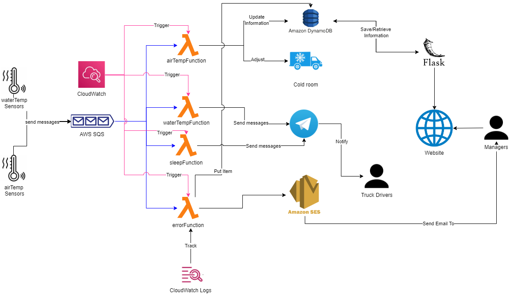

# Overview
The owner of a Transportation company, owns 5 trucks and is constantly working to expand. He would like to have complete control over what happens in his company's in order to improve earnings, preserve the proper operation of his trucks, and to improve the work of his truck drivers.

#	Truck Manager

**Truck manager** is a project carried out for the Serverless Computing for IoT exam that is designed to help manage his company and helping his truck drivers. With it the company's Managers can, through a web portal:

- Have control over the trucks, through a simple Dashboard to view the basic information of the vehicle and the temperatures inside the freezing chambers detected by sensors and managed automatically.

- Ability to mark the date/time of the transport arrives/departures, in order to ensure good performance of the drivers through periodic monitoring of the hours worked, automatically reporting irregularities to the truck drivers.

- Ability to monitor sensors by receiving email and viewing statistics of errors found on them.

Truckers also receive benefit from the:
- Truck water temperature monitoring

- Warnings not to exceed working hours
##	Implementation
For this purpose, the following have been used:
- Air Temperature Sensors: These are placed in the freezing chambers of each truck to monitor their temperature and send a message to the `airTemperature` queue. The message contains information about the truck on which it was detected, the temperature itself, and date/time of detection. The lambda function `airTempFunction` every 15 minutes is triggered, checks the queue, processes the messages, saves the detections within the database for display in the dashboard, and automatically sets new temperatures to continue to keep the cell at the right temperature, displaying a message.

- Water Temperature Sensors: These are placed in the engine of each truck in order to accurately detect the water temperature and send a message to the `waterTemperature` queue or the `errors` queue if it malfunctions. The message sent to the `waterTemperature` queue contains information about the truck on which it was detected, the temperature itself and date/time of detection. The lambda `waterTempFunction` every 30 minutes is triggered, checks the queue, processes the messages, and checks the water temperature of the truck. If the temperature is found to be too high it sends a message to the Telegram bot, warning the truck driver to stop.
The messages sent to the `errors` queue contains information about the truck on which the error occurred and the date/time of detection. The lambda `errorFunction` every day at 12 noon is triggered, checks the queue, processes the messages, saves the information to the database for statistical purposes, and sends an email to alert the managers.

The web app also allows you to indicate for each vehicle the the date and time of the transport arrives/departures by saving them to the database. It is important for managers to manage this since, by law and to always ensure that each driver is working at his or her maximum capacity the 9-hour workday should never be exceeded. Every 30 minutes the `sleepFunction` is triggered, which checks the start time of the transport, checking if the 9 hours of work has been exceeded by alerting the truck driver via a message to the Telegram bot to stop immediately and go to sleep.

# Architecture

- **Cloud Infrastructure**: AWS Services simulated through a cloud service emulator [Localstack](https://docs.localstack.cloud/get-started/)
- **IoT devices**: Simulated with Python function using AWS SDK for Python ([Boto3](https://boto3.amazonaws.com/v1/documentation/api/latest/index.html))
- **AWS SQS** [Amazon Simple Queue Service](https://aws.amazon.com/it/sqs/details/)  a Web service that allows messages waiting to be sent to be stored via a queuing system. Used to store messages from the IoT sensors, retrieved after by the Lambda Function.
- **AWS Lambda**: [Lambda](https://docs.aws.amazon.com/lambda/latest/dg/welcome.html) is an event-driven compute service that lets you run code without provisioning or managing servers.
- **AWS DynamoDB**: [DynamoDB](https://docs.aws.amazon.com/amazondynamodb/latest/developerguide/Introduction.html) is a fully managed NoSQL database service that provides fast and predictable performance with seamless scalability.
- **AWS CloudWatch**: [CloudWatch](https://docs.aws.amazon.com/AmazonCloudWatch/latest/monitoring/WhatIsCloudWatch.html) implements the rule which invoke the serverless function.
- **AWS SES**: [Simple Email Service](https://docs.aws.amazon.com/ses/latest/dg/Welcome.html) is an email platform that provides an easy, cost-effective way for you to send and receive email using your own email addresses and domains.
- **AWS CloudWatch Logs**: [CloudWatch Logs](https://docs.aws.amazon.com/AmazonCloudWatch/latest/logs/WhatIsCloudWatchLogs.html) enables you to centralize the logs from all of your systems, applications, and AWS services that you use, in a single, highly scalable service. It has been used for monitor the email sent with log files.
- **Flask**: [Flask](https://flask.palletsprojects.com/en/2.2.x/)  is a web application framework written in Python. It works the [Werkzeg WSGI](https://palletsprojects.com/p/werkzeug/) toolkit and the [Jinja2](https://palletsprojects.com/p/jinja/) template engine.
- **Telegram**: Telegram is a cloud-based instant messaging service.

# Requisites and installation
##	Requisites
-	[Docker](https://docs.docker.com/get-docker/)
-	[AWS CLI](https://docs.aws.amazon.com/cli/latest/userguide/getting-started-install.html)
-	[boto3](https://boto3.amazonaws.com/v1/documentation/api/latest/guide/quickstart.html)
-	[Flask](https://flask.palletsprojects.com/en/2.2.x/)
-	[NodeJs](https://nodejs.org/it/) (Optional) for database visualization.
### Installation
####	AWS CLI installation and configuration
Follow the guide at [link](https://docs.aws.amazon.com/cli/latest/userguide/getting-started-install.html) for AWS CLI installation.
Configure it following the *quick configuration with aws configure* at [link](https://docs.aws.amazon.com/cli/latest/userguide/cli-configure-quickstart.html)
#### Docker
Install Docker by downloading it at [link](https://docs.docker.com/engine/install/ubuntu/)
#### Python and libraries
Run commands below to install Python and it's libraries.

    sudo apt install python3-pip
    pip install boto3
    pip install flask

#### NodeJS and DynamoDB-Admin (Optional)
Run commands below to install NodeJS in order to run DynamoDB Admin GUI

    sudo apt install npm
    sudo npm install -g dynamodb-admin

# Environment Setup
### 1. Clone the repository:

    git clone https://github.com/AlessioCasolaro/TruckManager_SCIOT-Exam.git

### 2. Open a console and launch LocalStack:

    sudo docker run --rm -it -p 4566:4566 -p 4571:4571 localstack/localstack

### 3. Create and populate DynamoDB tables:

    python3 codes/dynamoDB.py
>It also create the log group for the email

##### (Optional) Run dynamodb-admin GUI:

    DYNAMO_ENDPOINT=http://0.0.0.0:4566 dynamodb-admin
Open it at http://0.0.0.0:8001/

### 4. Create SQS queues:

    aws sqs create-queue --queue-name airTemperature --endpoint-url=http://localhost:4566
    
    aws sqs create-queue --queue-name waterTemperature --endpoint-url=http://localhost:4566
    
    aws sqs create-queue --queue-name errors --endpoint-url=http://localhost:4566

### 5. Verify SES email identity:

    aws ses verify-email-identity --email-address errors@truckmanager.it --endpoint-url=http://localhost:4566

### 5. Create the time-triggered Lambda functions:

#### 5.1 Create the role:

    aws iam create-role --role-name lambdarole --assume-role-policy-document file://codes/role_policy.json --query 'Role.Arn' --endpoint-url=http://localhost:4566

#### 5.2 Attach the policy:

    aws iam put-role-policy --role-name lambdarole --policy-name lambdapolicy --policy-document file://codes/policy.json --endpoint-url=http://localhost:4566

####  5.3 Create Lambda zip files:

    zip -j airTempFunction.zip codes/airTempFunction.py codes/config.py
    
    zip -j waterTempFunction.zip codes/waterTempFunction.py codes/config.py
    
    zip -j errorFunction.zip codes/errorFunction.py codes/config.py
    
    zip -j sleepFunction.zip codes/sleepFunction.py codes/config.py

#### 5.4 Create the function and save the ARN:

    aws lambda create-function --function-name airTempFunction --zip-file fileb://airTempFunction.zip --handler airTempFunction.lambda_handler --runtime python3.9 --role arn:aws:iam::000000000000:role/lambdarole --endpoint-url=http://localhost:4566
    
    aws lambda create-function --function-name waterTempFunction --zip-file fileb://waterTempFunction.zip --handler waterTempFunction.lambda_handler --runtime python3.9 --role arn:aws:iam::000000000000:role/lambdarole --endpoint-url=http://localhost:4566
    
    aws lambda create-function --function-name errorFunction --zip-file fileb://errorFunction.zip --handler errorFunction.lambda_handler --runtime python3.9 --role arn:aws:iam::000000000000:role/lambdarole --endpoint-url=http://localhost:4566
    
    aws lambda create-function --function-name sleepFunction --zip-file fileb://sleepFunction.zip --handler sleepFunction.lambda_handler --runtime python3.9 --role arn:aws:iam::000000000000:role/lambdarole --endpoint-url=http://localhost:4566

#### 5.5 Create CloudWatch trigger rules and save the ARN:

    aws events put-rule --name every15Min --schedule-expression 'rate(15 minute)' --endpoint-url http://localhost:4566
    
    aws events put-rule --name every30Min --schedule-expression 'rate(30 minute)' --endpoint-url http://localhost:4566
    
    aws events put-rule --name everyDayAt12 --schedule-expression 'cron(0 12 ? * * *)' --endpoint-url http://localhost:4566

#### 5.6 Add permissions to the rule:

    aws lambda add-permission --function-name airTempFunction --statement-id every15Min --action 'lambda:InvokeFunction' --principal events.amazonaws.com --source-arn arn:aws:events:us-east-2:000000000000:rule/airTempFunction --endpoint-url=http://localhost:4566
    
    aws lambda add-permission --function-name waterTempFunction --statement-id every30Min --action 'lambda:InvokeFunction' --principal events.amazonaws.com --source-arn arn:aws:events:us-east-2:000000000000:rule/waterTempFunction --endpoint-url=http://localhost:4566
    
    aws lambda add-permission --function-name errorFunction --statement-id everyDayAt12 --action 'lambda:InvokeFunction' --principal events.amazonaws.com --source-arn arn:aws:events:us-east-2:000000000000:rule/errorFunction --endpoint-url=http://localhost:4566
    
    aws lambda add-permission --function-name sleepFunction --statement-id every30Min --action 'lambda:InvokeFunction' --principal events.amazonaws.com --source-arn arn:aws:events:us-east-2:000000000000:rule/sleepFunction --endpoint-url=http://localhost:4566

#### 5.7 Add the lambda function to the rule:

    aws events put-targets --rule every15Min --targets file://codes/airTemp_targets.json --endpoint-url=http://localhost:4566
    
    aws events put-targets --rule every30Min --targets file://codes/waterTemp_targets.json --endpoint-url=http://localhost:4566
    
    aws events put-targets --rule everyDayAt12 --targets file://codes/error_targets.json --endpoint-url=http://localhost:4566
    
    aws events put-targets --rule every30Min --targets file://codes/sleep_targets.json --endpoint-url=http://localhost:4566

# How to run
#### Create your Telegram BOT:
- Create your Telegram BOT through @BotFather on Telegram.
- Save the given BOT Token
- Paste it on @JsonDumpBot
- Save your CHAT ID
#### Configurate config.py file:
- Set the endpoint used for LocalStack to `ENDPOINT_URL` (Default should be `http://localhost:4566`).
- Paste your Telegram Token at `TOKEN_TELEGRAM`
- Paste your Chat ID at `CHAT_ID`
- Set a random string to `FLASK_SECRET_KEY`.
- Set the email used for Errors at `EMAIL` (Should be `errors@truckmanager.it`).
#### Simulate the IoT devices:

    python3 codes/airTempSensor.py
    
    python3 codes/waterTempSensor.py

#### Run Flask:

    python3 app.py

Go to http://127.0.0.1:5000/

#### Check logs about email sent

    aws logs get-log-events --log-group-name ErrorDetected --log-stream-name ErrorDetected --endpoint-url=http://localhost:4566

# What's next?
- Add other useful sensor on the Trucks, like:
    -   GPS devices that provide information about drivers’ speed and how hard they accelerate, and these indicators affect fuel consumption.
    -   Fuel devices and Oil Detector devices to full check the trucks.

- Add section in the websites for the truck drivers.

